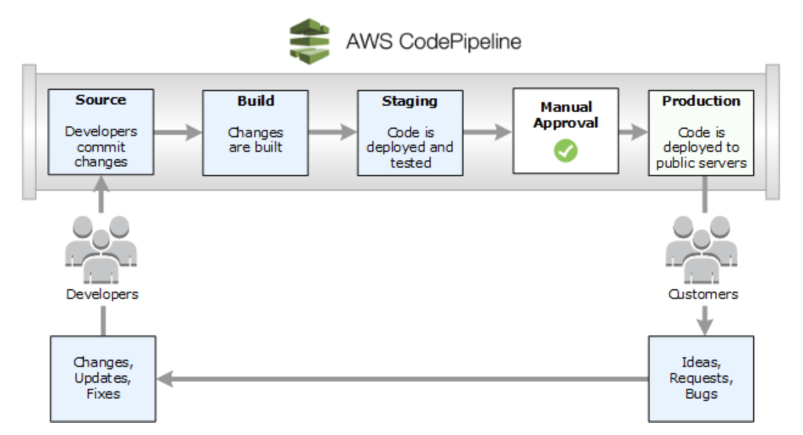
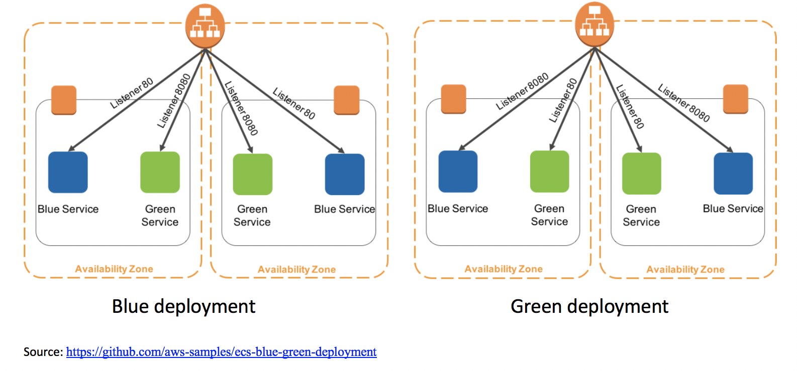
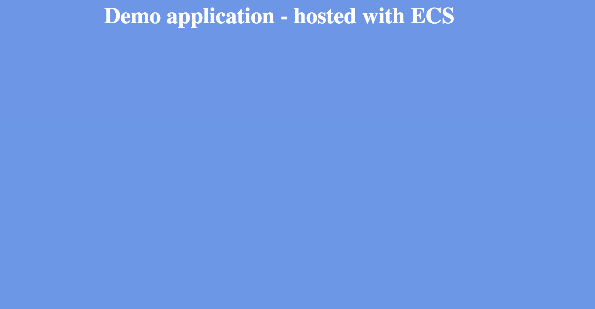
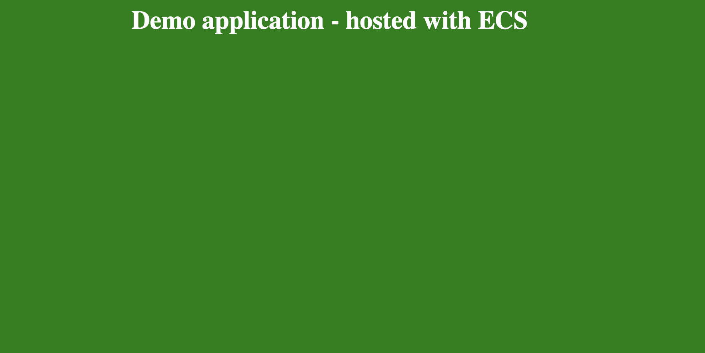

# ECS FARGATE의 블루/그린 배포

이 장에서는 ECS Fargate에 데모 애플리케이션을 배포하고 CodeDeploy 및 ECS의 Blue/Green 배포 기능을 사용하여 애플리케이션을 업데이트합니다.

블루/그린 배포는 동일한 애플리케이션의 다른 버전을 실행하는 두 개의 동일한 환경 간에 트래픽을 이동하여 애플리케이션을 릴리스하는 기술입니다. 블루/그린 배포는 다운타임 및 롤백 기능과 같은 소프트웨어 배포와 관련된 위험을 완화하므로 중요한 워크로드에 권장됩니다.

전통적으로 인플레이스(in-place) 업그레이드를 사용하면 애플리케이션의 이전 버전을 계속 실행하면서 프로덕션 배포에서 새 애플리케이션 버전을 검증하는 것이 어려웠습니다. 친환경 환경을 배포한 후에는 이를 검증할 수 있습니다. 녹색 환경이 예상대로 작동하지 않는 것을 발견하면 파란색 환경에 영향을 미치지 않습니다. 트래픽을 다시 해당 사이트로 라우팅하여 작동 장애 또는 가동 중지 시간을 최소화하고 충격 반경을 제한할 수 있습니다.

트래픽을 계속 작동하는 블루 환경으로 간단히 롤백할 수 있는 이 기능은 블루/그린 배포의 주요 이점입니다. 배포 프로세스 중 언제든지 블루 환경으로 롤백할 수 있습니다.

당신은 이것에 대해 더 읽을 수 있습니다 AWS 백서

시작하자…

## 애플리케이션을 만나보세요
ECS Fargate에 데모 애플리케이션을 배포할 것입니다.

이 애플리케이션은 NGINX에서 Fargate 서비스로 실행되는 정적 웹 페이지입니다.
CodePipeline은 CodeCommit, CodeBuild 및 CodeDeploy를 사용하여 블루/그린 배포를 실행하는 데 사용됩니다.
컨테이너 이미지는 Elastic Container Registry에 저장됩니다.
아래는 우리가 구축할 환경의 다이어그램입니다.


## 코드파이프라인 입문서
AWS 코드 파이프라인 완전 관리형입니다 지속적인 납품빠르고 안정적인 애플리케이션 및 인프라 업데이트를 위해 릴리스 파이프라인을 자동화하는 데 도움이 되는 서비스입니다. CodePipeline은 정의한 릴리스 모델을 기반으로 코드 변경이 있을 때마다 릴리스 프로세스의 빌드, 테스트 및 배포 단계를 자동화합니다.



블루/그린 배포를 통해 새로운 컨테이너 세트를 프로비저닝할 수 있습니다. 코드 배포최신 버전의 애플리케이션을 설치합니다. 그런 다음 CodeDeploy는 이전 버전의 애플리케이션을 실행하는 기존 컨테이너 집합에서 최신 버전을 실행하는 새 컨테이너 집합으로 로드 밸런서 트래픽을 다시 라우팅합니다. 트래픽이 새 컨테이너로 다시 라우팅된 후 기존 컨테이너를 종료할 수 있습니다. 블루/그린 배포를 통해 프로덕션 트래픽을 보내기 전에 새 애플리케이션 버전을 테스트할 수 있습니다.



새로 배포된 애플리케이션 버전에 문제가 있는 경우 전체 배포보다 더 빠르게 이전 버전으로 롤백할 수 있습니다. 또한 블루/그린 배포를 위해 프로비저닝된 컨테이너는 새 구성이므로 최신 서버 구성을 반영합니다.

## 환경 구축
전제 조건 설치

```
sudo yum install -y jq
npm i -g -f aws-cdk@1.54.0
```

리포지토리로 이동

```
git clone https://github.com/adamjkeller/ecs-codepipeline-demo ~/environment/ecs-codepipeline-demo
cd ~/environment/ecs-codepipeline-demo
```

스택 빌드

```
npm install
npm run build
```

부트스트랩 CDK
그러면 파일 자산과 배포할 CloudFormation 템플릿이 포함된 S3 버킷이 생성됩니다.

```
cdk bootstrap
```

코드 검토
이전 환경과 마찬가지로 AWS CDK를 사용하여 환경을 구축할 때도 동일한 형식을 따릅니다.

뛰어들자

ECR 및 CodeCommit 리포지토리 생성

```
// ECR repository for the docker images
const ecrRepo = new ecr.Repository(this, 'demoAppEcrRepo', {
    imageScanOnPush: true
});

// CodeCommit repository for storing the source code
const codeRepo = new codeCommit.Repository(this, "demoAppCodeRepo", {
    repositoryName: BlueGreenUsingEcsStack.ECS_APP_NAME,
    description: "Demo application hosted on NGINX"
});
```

CodeBuild 프로젝트를 생성합니다. 빌드 단계에서 필요한 ENVIRONMENT 변수를 제공합니다. 이 변수는 업데이트에 사용됩니다.buildspec.yml,taskdef.json 그리고 appspec.yaml. 스택이 빌드된 후 이러한 구성 파일을 살펴보겠습니다.

```
// Creating the code build project
const demoAppCodeBuild = new codeBuild.Project(this, "demoAppCodeBuild", {
    role: codeBuildServiceRole,
    description: "Code build project for the demo application",
    environment: {
        buildImage: codeBuild.LinuxBuildImage.STANDARD_4_0,
        computeType: ComputeType.SMALL,
        privileged: true,
        environmentVariables: {
            REPOSITORY_URI: {
                value: ecrRepo.repositoryUri,
                type: BuildEnvironmentVariableType.PLAINTEXT
            },
            TASK_EXECUTION_ARN: {
                value: ecsTaskRole.roleArn,
                type: BuildEnvironmentVariableType.PLAINTEXT
            },
            TASK_FAMILY: {
                value: BlueGreenUsingEcsStack.ECS_TASK_FAMILY_NAME,
                type: BuildEnvironmentVariableType.PLAINTEXT
            }
        }
    },
    source: codeBuild.Source.codeCommit({
        repository: codeRepo
    })
});
```

애플리케이션 로드 밸런서 및 대상 그룹이 있는 ECS 클러스터를 생성합니다. 파란색과 녹색의 두 가지 대상 그룹이 있습니다. 프로덕션 리스너 포트는 80이고 테스트 리스너 포트는8080

```
// Creating the VPC
const vpc = new ec2.Vpc(this, 'vpcForECSCluster');

// Creating a ECS cluster
const cluster = new ecs.Cluster(this, 'ecsClusterForWorkshop', {vpc});

// Creating an application load balancer, listener and two target groups for Blue/Green deployment
const alb = new elb.ApplicationLoadBalancer(this, "alb", {
    vpc: vpc,
    internetFacing: true
});
const albProdListener = alb.addListener('albProdListener', {
    port: 80
});
const albTestListener = alb.addListener('albTestListener', {
    port: 8080
});

albProdListener.connections.allowDefaultPortFromAnyIpv4('Allow traffic from everywhere');
albTestListener.connections.allowDefaultPortFromAnyIpv4('Allow traffic from everywhere');

// Target group 1
const blueGroup = new elb.ApplicationTargetGroup(this, "blueGroup", {
    vpc: vpc,
    protocol: ApplicationProtocol.HTTP,
    port: 80,
    targetType: TargetType.IP,
    healthCheck: {
        path: "/",
        timeout: Duration.seconds(10),
        interval: Duration.seconds(15)
    }
});

// Target group 2
const greenGroup = new elb.ApplicationTargetGroup(this, "greenGroup", {
    vpc: vpc,
    protocol: ApplicationProtocol.HTTP,
    port: 80,
    targetType: TargetType.IP,
    healthCheck: {
        path: "/",
        timeout: Duration.seconds(10),
        interval: Duration.seconds(15)
    }
});

// Registering the blue target group with the production listener of load balancer
albProdListener.addTargetGroups("blueTarget", {
    targetGroups: [blueGroup]
});

// Registering the green target group with the test listener of load balancer
albTestListener.addTargetGroups("greenTarget", {
    targetGroups: [greenGroup]
});
```

CodeDeploy의 DeploymentGroup에 대해 사용자 지정 리소스를 사용했습니다. CDK 구성은 ECS 배포 그룹 생성을 지원하지 않습니다. 먼저 다음을 사용하여 람다를 만듭니다.new lambda.Function, 다음을 사용하여 사용자 지정 리소스를 만듭니다. new CustomResource

```
// Creating the code deploy application
const codeDeployApplication = new codeDeploy.EcsApplication(this, "demoAppCodeDeploy");

// Custom resource to create the deployment group
const createDeploymentGroupLambda = new lambda.Function(this, 'createDeploymentGroupLambda', {
    code: lambda.Code.fromAsset(
        path.join(__dirname, 'custom_resources'),
        {
            exclude: ["**", "!create_deployment_group.py"]
        }),
    runtime: lambda.Runtime.PYTHON_3_8,
    handler: 'create_deployment_group.handler',
    role: customLambdaServiceRole,
    description: "Custom resource to create deployment group",
    memorySize: 128,
    timeout: cdk.Duration.seconds(60)
});

new CustomResource(this, 'customEcsDeploymentGroup', {
    serviceToken: createDeploymentGroupLambda.functionArn,
    properties: {
        ApplicationName: codeDeployApplication.applicationName,
        DeploymentGroupName: BlueGreenUsingEcsStack.ECS_DEPLOYMENT_GROUP_NAME,
        DeploymentConfigName: BlueGreenUsingEcsStack.ECS_DEPLOYMENT_CONFIG_NAME,
        ServiceRoleArn: codeDeployServiceRole.roleArn,
        BlueTargetGroup: blueGroup.targetGroupName,
        GreenTargetGroup: greenGroup.targetGroupName,
        ProdListenerArn: albProdListener.listenerArn,
        TestListenerArn: albTestListener.listenerArn,
        EcsClusterName: cluster.clusterName,
        EcsServiceName: demoAppService.serviceName,
        TerminationWaitTime: BlueGreenUsingEcsStack.ECS_TASKSET_TERMINATION_WAIT_TIME,
        BlueGroupAlarm: blueGroupAlarm.alarmName,
        GreenGroupAlarm: greenGroupAlarm.alarmName,
    }
});
```

블루/그린 배포를 위한 코드 파이프라인. 이 파이프라인에는 소스, 빌드 및 배포의 세 단계가 있습니다.

```
// Code Pipeline - CloudWatch trigger event is created by CDK
new codePipeline.Pipeline(this, "ecsBlueGreen", {
    role: codePipelineServiceRole,
    artifactBucket: demoAppArtifactsBucket,
    stages: [
        {
            stageName: 'Source',
            actions: [
                new codePipelineActions.CodeCommitSourceAction({
                    actionName: 'Source',
                    repository: codeRepo,
                    output: sourceArtifact,
                }),
            ]
        },
        {
            stageName: 'Build',
            actions: [
                new codePipelineActions.CodeBuildAction({
                    actionName: 'Build',
                    project: demoAppCodeBuild,
                    input: sourceArtifact,
                    outputs: [buildArtifact]
                })
            ]
        },
        {
            stageName: 'Deploy',
            actions: [
                new codePipelineActions.CodeDeployEcsDeployAction({
                    actionName: 'Deploy',
                    deploymentGroup: ecsDeploymentGroup,
                    appSpecTemplateInput: buildArtifact,
                    taskDefinitionTemplateInput: buildArtifact,
                })
            ]
        }
    ]
});
```

CloudFormation 템플릿 합성

```
cdk synth
```

cdk가 환경에서 구축 및/또는 변경을 제안하는 내용을 검토합니다.

```
cdk diff
```

리소스 배포
메모:
스택은 CIDR이 있는 새 VPC를 생성합니다. 10.0.0.0/16
스택은 이라는 이름의 새 CodeCommit 리포지토리를 생성합니다. demo-app

```
cdk deploy --require-approval never
```

성공적인 배포는 아래 값을 출력합니다.

BlueGreenUsingEcsStack.ecsBlueGreenLBDns
BlueGreenUsingEcsStack.ecsBlueGreenCodeRepo

로드 밸런서 URL 내보내기

```
export cloudformation_outputs=$(aws cloudformation describe-stacks --stack-name BlueGreenUsingEcsStack | jq '.Stacks[].Outputs')
export load_balancer_url=$(echo $cloudformation_outputs | jq -r '.[]| select(.ExportName | contains("ecsBlueGreenLBDns"))| .OutputValue')
```

배포된 애플리케이션 버전을 살펴보겠습니다.

## 블루 배포 검토
브라우저에서 서비스 열기
로드 밸런서 URL을 통해 배포된 블루 버전에 액세스할 수 있습니다. 브라우저에서 열어봅시다.

다음 명령을 실행하여 URL을 가져옵니다.

```
echo "http://$load_balancer_url"
```

결과
엔드포인트는 배포된 애플리케이션의 버전(파란색)을 표시합니다.



이제 Green 배포를 위해 CodeCommit에서 git 리포지토리를 설정할 차례입니다.

## CODECOMMIT 리포지토리 업데이트
CodeCommit 리포지토리에 소스 코드 푸시
스택이 빈 CodeCommit 리포지토리 - 를 생성했습니다 demo-app. 이제 샘플 데모 응용 프로그램으로 채울 것입니다.

데모 애플리케이션 복제

```
cd ~/environment
git clone https://github.com/smuralee/nginx-example.git
```

원격 원본 URL 업데이트
원격 오리진을 CodeCommit 리포지토리로 변경합니다. 저장소 URL을 가져옵니다.

```
cd ~/environment/nginx-example
git remote set-url origin $(aws codecommit get-repository --repository-name demo-app | jq -r '.repositoryMetadata.cloneUrlHttp')
```

원격 원본 URL이 CodeCommit 리포지토리를 가리키는지 확인합니다.

```
git remote -v
```

를 편집합니다 index.html. 우리는 변화 background-color에green

```
<head>
  <title>Demo Application</title>
</head>
<body style="background-color: green;">
  <h1 style="color: white; text-align: center;">
    Demo application - hosted with ECS
  </h1>
</body>
```

CodeCommit 리포지토리에 코드 푸시

```
git add .
git commit -m "Changed background to green"
git push
```

CodePipeline으로 이동
코드 푸시가 파이프라인 실행을 트리거했습니다.
파이프라인에는 세 단계가 있습니다.
원천
git 저장소에서 코드 풀다운
빌드 단계에 대한 코드 패키징
짓다
코드에서 Docker 이미지 빌드
ECR 저장소로 푸시
배포 단계에 대한 아티팩트 패키징
배포
ECS 서비스에 대한 블루/그린 배포 시작


다음으로 배포를 검토하겠습니다.

## 친환경 배포 검토
파이프라인의 배포 단계를 클릭합니다.
그러면 ECS 서비스의 배포 상태로 이동합니다.


1단계:taskdef.json 빌드 단계에서 생성된 새 이미지를 기반으로 대체 작업 세트를 배포합니다.
2단계: 새 작업을 설정하고 포트에서 테스트 수신기를 활성화합니다.8080
일단 2 단계 : 완료,로드 밸런서 테스트 리스너 포트에 브라우저에서 서비스를 엽니 다8080

다음은 url을 가져오는 명령입니다.

```
echo "http://$load_balancer_url:8080"
```

배경색이 녹색으로 변경된 데모 애플리케이션이 표시됩니다.



3단계: 블루에서 그린 배포로 트래픽 이동 시작
배포 구성을 사용하여 파란색에서 녹색으로 원활한 트래픽 이동이 있습니다 CodeDeployDefault.ECSLinear10PercentEvery1Minutes. 모든 트래픽이 전환될 때까지 1분마다 트래픽의 10%를 전환합니다.
완료되면 포트 80에 Green Deployment 가 표시됩니다.

다음은 url을 가져오는 명령입니다.

```
echo "http://$load_balancer_url"
```

4단계 는 이전 작업 세트가 10분 동안 유지되는 곳입니다. 이 기간은 CDK 스택을 통해 구성할 수 있습니다.
5단계 는 원래 작업 세트를 종료합니다.

Blue/Green 배포를 성공적으로 완료했습니다. 이제 실패한 배포를 롤백해 보겠습니다.

## 롤백 실패 배포
주요 변경 사항 도입
여기에서 404 응답 코드를 반환하여 자동화된 롤백을 트리거합니다. 일반적으로 Application Load Balancer는 이 오류를 포착하지만 데모를 위해 허용 가능한 상태 확인 응답으로 허용합니다.

nginx.conf기본값 대신 404 오류를 반환하도록 편집index.html
/location 지시문을 다음과 같이 수정합니다.

```
listen  80;
root    /usr/share/nginx/html;
include /etc/nginx/mime.types;

location / {
    return 404;
}
```

전체 nginx.conf를 보려면 확장하십시오.

```
# Run as a less privileged user for security reasons.
user nginx;

# Number of worker_threads to run;
# "auto" sets it to the #CPU_cores available in the system, and
# offers the best performance.
worker_processes    auto;

events { worker_connections 1024; }

http {
    server {
        # Hide nginx version information.
        server_tokens off;

        listen  80;
        root    /usr/share/nginx/html;
        include /etc/nginx/mime.types;

        location / {
            return 404;
        }

        gzip            on;
        gzip_vary       on;
        gzip_http_version  1.0;
        gzip_comp_level 5;
        gzip_types
                        application/atom+xml
                        application/javascript
                        application/json
                        application/rss+xml
                        application/vnd.ms-fontobject
                        application/x-font-ttf
                        application/x-web-app-manifest+json
                        application/xhtml+xml
                        application/xml
                        font/opentype
                        image/svg+xml
                        image/x-icon
                        text/css
                        text/plain
                        text/x-component;
        gzip_proxied    no-cache no-store private expired auth;
        gzip_min_length 256;
        gunzip          on;
    }
}
```

CodeCommit 리포지토리에 코드 푸시

```
cd ~/environment/nginx-example
git add .
git commit -m "Returning 404 error"
git push
```

코드 푸시는 CodePipeline을 트리거합니다.


CodeDeploy는 이전과 같이 배포를 시작합니다.
한때 3 단계 트래픽 이동이 시작되고, 우리는로드 밸런서 포트에 브라우저에서 서비스를 엽니 다80
다음은 url을 가져오는 명령입니다.

```
echo "http://$load_balancer_url"
```

404 Not Found 오류를 반환하는 페이지를 볼 수 있습니다.
ELB 대상 그룹에서 4XX 오류를 찾는 CloudWatch 경보를 구성했습니다.

확장하여 코드 보기

```
// CloudWatch Alarms for 4XX errors
const blue5xxMetric = new cloudWatch.Metric({
    namespace: 'AWS/ApplicationELB',
    metricName: 'HTTPCode_Target_4XX_Count',
    dimensions: {
        TargetGroup: blueGroup.targetGroupFullName,
        LoadBalancer: alb.loadBalancerFullName
    },
    statistic: cloudWatch.Statistic.SUM,
    period: Duration.minutes(1)
});
const blueGroupAlarm = new cloudWatch.Alarm(this, "blue4xxErrors", {
    alarmName: "Blue_4xx_Alarm",
    alarmDescription: "CloudWatch Alarm for the 4xx errors of Blue target group",
    metric: blue5xxMetric,
    threshold: 1,
    evaluationPeriods: 1
});

const green5xxMetric = new cloudWatch.Metric({
    namespace: 'AWS/ApplicationELB',
    metricName: 'HTTPCode_Target_4XX_Count',
    dimensions: {
        TargetGroup: greenGroup.targetGroupFullName,
        LoadBalancer: alb.loadBalancerFullName
    },
    statistic: cloudWatch.Statistic.SUM,
    period: Duration.minutes(1)
});
const greenGroupAlarm = new cloudWatch.Alarm(this, "green4xxErrors", {
    alarmName: "Green_4xx_Alarm",
    alarmDescription: "CloudWatch Alarm for the 4xx errors of Green target group",
    metric: green5xxMetric,
    threshold: 1,
    evaluationPeriods: 1
});
```

CodeDeploy는 CloudWatch 경보가 경보 상태인 경우 자동 롤백을 시작하도록 구성됩니다.
CodeDeploy가 배포를 중지합니다.
CodeDeploy는 이제 프로덕션 트래픽을 원래 작업 세트로 다시 라우팅합니다.
마지막으로 CodeDeploy는 대체 작업 세트를 종료합니다.
브라우저에서 서비스를 새로 고치면 원래의 녹색 배경 배포가 표시됩니다.

블루/그린 배포를 성공적으로 완료하고 실패한 배포의 자동 롤백을 수행했습니다. 이제 구성 파일을 검토해 보겠습니다.

## 구성 검토
CodeCommit 리포지토리 열기


CodeBuild는 buildspec.yml도커 이미지를 빌드하고 Elastic Container Registry로 푸시하는 데 사용합니다.
buildspec.yml소스 코드 저장소의 루트에 보관하십시오 .

buildspec.yml을 보려면 펼치십시오.

```
version: 0.2

phases:
  pre_build:
    commands:
      - echo Logging in to Amazon ECR...
      - aws --version
      - aws ecr get-login-password | docker login --username AWS --password-stdin $REPOSITORY_URI
      - COMMIT_HASH=$(echo $CODEBUILD_RESOLVED_SOURCE_VERSION | cut -c 1-7)
      - IMAGE_TAG=${COMMIT_HASH:=latest}
  build:
    commands:
      - echo Docker build and tagging started on `date`
      - docker build -t $REPOSITORY_URI:latest -t $REPOSITORY_URI:$IMAGE_TAG .
      - echo Docker build and tagging completed on `date`
  post_build:
    commands:
      - echo Build completed on `date`
      - echo Pushing the docker images...
      - docker push $REPOSITORY_URI:latest
      - docker push $REPOSITORY_URI:$IMAGE_TAG
      - echo Update the REPOSITORY_URI:IMAGE_TAG in task definition...
      - echo Container image to be used $REPOSITORY_URI:$IMAGE_TAG
      - sed -i 's@REPOSITORY_URI@'$REPOSITORY_URI'@g' taskdef.json
      - sed -i 's@IMAGE_TAG@'$IMAGE_TAG'@g' taskdef.json
      - echo update the REGION in task definition...
      - sed -i 's@AWS_REGION@'$AWS_REGION'@g' taskdef.json
      - echo update the roles in task definition...
      - sed -i 's@TASK_EXECUTION_ARN@'$TASK_EXECUTION_ARN'@g' taskdef.json
      - echo update the task family name in task definition...
      - sed -i 's@TASK_FAMILY@'$TASK_FAMILY'@g' taskdef.json
      - echo update the container name in appspec.yaml...
      - sed -i 's@TASK_FAMILY@'$TASK_FAMILY'@g' appspec.yaml
artifacts:
  files:
    - "appspec.yaml"
    - "taskdef.json"
```

아티팩트 appspec.yaml및 taskdef.jsonCodeDeploy에서 사용됩니다.

Amazon ECS 컴퓨팅 플랫폼 애플리케이션의 경우 AppSpec file은 CodeDeploy에서 Amazon ECS 작업 정의 파일을 결정하는 데 사용됩니다. TASK_DEFINITION플레이스홀더는 새로운 taskdef.json. TASK_FAMILY빌드 단계에서 교체합니다 .

appspec.yaml을 보려면 펼치십시오.

```
version: 0.0
Resources:
  - TargetService:
      Type: AWS::ECS::Service
      Properties:
        TaskDefinition: "<TASK_DEFINITION>"
        LoadBalancerInfo:
          ContainerName: "TASK_FAMILY"
          ContainerPort: 80
```

taskdef.jsonECS 작업 정의입니다. 각 배포에 대해 CodeDeploy에 의해 새 버전이 생성됩니다. CodePipeline의 CodeBuild 단계에서 아래 자리 표시자를 교체합니다.
AWS_REGION
TASK_FAMILY
REPOSITORY_URI:IMAGE_TAG

taskdef.json을 보려면 펼치십시오.

```
{
  "containerDefinitions": [
    {
      "name": "TASK_FAMILY",
      "image": "REPOSITORY_URI:IMAGE_TAG",
      "portMappings": [
        {
          "containerPort": 80,
          "protocol": "tcp"
        }
      ],
      "essential": true,
      "dockerLabels": {
        "name": "TASK_FAMILY"
      },
      "logConfiguration": {
        "logDriver": "awslogs",
        "options": {
          "awslogs-group": "/ecs/TASK_FAMILY",
          "awslogs-region": "AWS_REGION",
          "awslogs-stream-prefix": "TASK_FAMILY"
        }
      }
    }
  ],
  "taskRoleArn": "TASK_EXECUTION_ARN",
  "executionRoleArn": "TASK_EXECUTION_ARN",
  "family": "TASK_FAMILY",
  "networkMode": "awsvpc",
  "requiresCompatibilities": ["FARGATE"],
  "cpu": "256",
  "memory": "1024"
}
```

의 자리 appspec.yaml와는 taskdef.json으로 대체되고있다buildspec.yml
CodeBuild 작업에는 ENVIRONMENTCDK 스택에서 변수로 사용할 수 있는 필수 값이 있습니다.

CodeBuild 구성을 보려면 펼치십시오.

```
// Creating the code build project
const demoAppCodeBuild = new codeBuild.Project(this, "demoAppCodeBuild", {
    role: codeBuildServiceRole,
    description: "Code build project for the demo application",
    environment: {
        buildImage: codeBuild.LinuxBuildImage.STANDARD_4_0,
        computeType: ComputeType.SMALL,
        privileged: true,
        environmentVariables: {
            REPOSITORY_URI: {
                value: ecrRepo.repositoryUri,
                type: BuildEnvironmentVariableType.PLAINTEXT
            },
            TASK_EXECUTION_ARN: {
                value: ecsTaskRole.roleArn,
                type: BuildEnvironmentVariableType.PLAINTEXT
            },
            TASK_FAMILY: {
                value: BlueGreenUsingEcsStack.ECS_TASK_FAMILY_NAME,
                type: BuildEnvironmentVariableType.PLAINTEXT
            }
        }
    },
    source: codeBuild.Source.codeCommit({
        repository: codeRepo
    })
});
```

CodeDeploy 및 ECS를 사용한 블루/그린 배포 검토를 완료했습니다. 리소스를 정리합시다.

## 대청소

```
cd ~/environment/ecs-codepipeline-demo
cdk destroy -f
```

S3 버킷과 ECR 리포지토리는 비어 있지 않으므로 수동으로 삭제해야 합니다.
