# ECS 클러스터에 대한 CLOUDWATCH CONTAINER INSIGHTS 구성

## 소개

이 장에서는 [Amazon CloudWatch Container Insights](https://docs.aws.amazon.com/AmazonECS/latest/developerguide/cloudwatch-container-insights.html)를 통해 ECS 환경에 대한 모니터링을 설정하는 방법에 대해 알아봅니다.

당신이 사용할 수있는 수집할 CloudWatch Container Insights, 컨테이너화된 애플리케이션 및 마이크로서비스의 메트릭 및 로그를 집계 및 요약합니다. Container Insights는 Amazon Elastic Container Service, Amazon Elastic Kubernetes Service 및 Amazon EC2의 Kubernetes 플랫폼에서 사용할 수 있습니다. 메트릭에는 CPU, 메모리, 디스크 및 네트워크와 같은 리소스에 대한 사용률이 포함됩니다. Container Insights는 또한 문제를 격리하고 신속하게 해결할 수 있도록 컨테이너 다시 시작 실패와 같은 진단 정보를 제공합니다.

Amazon CloudWatch 및 AWS X-Ray를 사용하는 관찰 가능성 기능에 대해 모두 알아보려면 다음을 참조하십시오. [observability-workshop](https://observability.workshop.aws/en/)

## 도구 설치 및 구성

Cloud9 작업 영역에서 다음 명령을 실행합니다.

설치 및 설정 전제 조건

```
# Install prerequisite packages
sudo yum -y install jq gettext
```

jq는 JSON 파일에 저장된 데이터를 추출하고 변환하는 데 사용할 수 있는 도구입니다.

gettext 패키지에는 환경 변수 값을 입력 스트림으로 대체하는 데 사용할 수 있는 envsubst 유틸리티가 포함되어 있습니다.

Linux 유틸리티 sed와 함께 이러한 도구를 사용하여 워크샵 전반에 걸쳐 다양한 파일에 속성 값을 삽입하거나 교체할 것입니다. 이렇게 하면 가능한 한 수동으로 텍스트를 편집할 필요가 없습니다.

```
# Setting environment variables required to communicate with AWS API's via the cli tools
echo "export AWS_DEFAULT_REGION=$(curl -s 169.254.169.254/latest/dynamic/instance-identity/document | jq -r .region)" >> ~/.bashrc
echo "export AWS_REGION=\$AWS_DEFAULT_REGION" >> ~/.bashrc
echo "export AWS_ACCOUNT_ID=$(aws sts get-caller-identity --query Account --output text)" >> ~/.bashrc
source ~/.bashrc
```

## 환경 구축

Cloud9 작업 영역에서 다음 명령을 실행합니다.

로드 밸런서 및 ECS에 대한 서비스 연결 역할이 있는지 확인합니다.

```
aws iam get-role --role-name "AWSServiceRoleForElasticLoadBalancing" || aws iam create-service-linked-role --aws-service-name "elasticloadbalancing.amazonaws.com"

aws iam get-role --role-name "AWSServiceRoleForECS" || aws iam create-service-linked-role --aws-service-name "ecs.amazonaws.com"
```

애플리케이션 설정 이 섹션에서는 컨테이너 인사이트를 설정합니다. 시작하려면 ECS에 환경과 프런트엔드 서비스를 배포해야 합니다. 이전 장에서 마이크로서비스를 배포했다면 이 단계를 건너뛰고 다음 페이지로 넘어갈 수 있습니다.

저장소 복제 서비스 저장소를 복제합니다.

```
cd ~/environment
git clone https://github.com/brentley/container-demo
git clone https://github.com/brentley/ecsdemo-frontend
git clone https://github.com/brentley/ecsdemo-nodejs
git clone https://github.com/brentley/ecsdemo-crystal
```

플랫폼 구축 먼저 프론트엔드 서비스가 실행될 환경을 구축해야 합니다. 우리가 만들고 있는 것에 대한 자세한 내용은 여기에서 코드를 검토할 수 있습니다.플랫폼.

```
cd ~/environment/container-demo/cdk
pip install -r requirements.txt
cdk context --clear && cdk deploy --require-approval never
```

마이크로서비스 배포 다음으로 3계층 다중 언어 웹 앱을 ECS 클러스터에 배포합니다. 배포 중인 항목에 대한 자세한 내용은 다음을 참조하십시오.마이크로서비스 워크샵 섹션.

```
cd ~/environment/ecsdemo-frontend/cdk
pip install -r requirements.txt
cdk context --clear && cdk deploy --require-approval never
cd ~/environment/ecsdemo-nodejs/cdk
pip install -r requirements.txt
cdk context --clear && cdk deploy --require-approval never
cd ~/environment/ecsdemo-crystal/cdk
pip install -r requirements.txt
cdk context --clear && cdk deploy --require-approval never
```

## 컨테이너 인사이트 설정

애플리케이션 설정 이 섹션에서는 방금 구축한 ECS 클러스터에 대한 컨테이너 통찰력을 설정합니다.

클러스터 이름 가져오기 다음 명령을 실행합니다. 그러면 계정 및 리전에 있는 ECS 클러스터가 나열되고 Container Insights를 활성화하는 데 필요한 클러스터 이름이 표시됩니다.

```
cluster_arn=$(aws ecs list-clusters | jq -r '.clusterArns[] | select(contains("container-demo"))')
clustername=$(aws ecs describe-clusters --clusters $cluster_arn | jq -r '.clusters[].clusterName')
```

컨테이너 인사이트 활성화 다음 명령을 실행하여 클러스터에서 Container Insights를 활성화합니다. 이 명령은 ECS 클러스터에서 서비스 및 클러스터 수준 통찰력을 활성화합니다.

```
aws ecs update-cluster-settings --cluster ${clustername}  --settings name=containerInsights,value=enabled --region ${AWS_REGION}
```

인스턴스 수준 통찰력 활성화 다음 명령은 ECS 클러스터에 인스턴스 수준 통찰력을 설치합니다.

```
aws cloudformation create-stack --stack-name CWAgentECS-$clustername-${AWS_REGION} --template-body "$(curl -Ls https://raw.githubusercontent.com/aws-samples/amazon-cloudwatch-container-insights/latest/ecs-task-definition-templates/deployment-mode/daemon-service/cwagent-ecs-instance-metric/cloudformation-quickstart/cwagent-ecs-instance-metric-cfn.json)" --parameters ParameterKey=ClusterName,ParameterValue=$clustername ParameterKey=CreateIAMRoles,ParameterValue=True --capabilities CAPABILITY_NAMED_IAM --region ${AWS_REGION}
```

ECS 클러스터에서 Container Insights 유효성 검사가 활성화되었습니다. 다음 명령을 실행

```
aws ecs describe-clusters --cluster ${clustername}
```

출력은 아래의 것과 유사해야 합니다. JSON의 설정 섹션에서 Container Insights가 활성화된 것을 볼 수 있습니다.

```
{
    "clusters": [
        {
            "status": "ACTIVE", 
            "statistics": [], 
            "tags": [], 
            "clusterName": "container-demo-ECSCluster-1E4H2VVHM9D2R", 
            "settings": [
                {
                    "name": "containerInsights", 
                    "value": "enabled"
                }
            ], 
            "registeredContainerInstancesCount": 0, 
            "pendingTasksCount": 0, 
            "runningTasksCount": 9, 
            "activeServicesCount": 3, 
            "clusterArn": "arn:aws:ecs:us-west-2:1234567899:cluster/container-demo-ECSCluster-1E4H2VVHM9D2R"
        }
    ], 
    "failures": []
}
```

## 컨테이너 인사이트 살펴보기

로그가 CloudWatch Logs로 스트리밍되는지 확인 로 이동 CloudWatch 로그 그리고 아래 형식의 로그 그룹을 볼 수 있는지 확인하십시오.

/aws/ecs/containerinsights/ 클러스터 이름 /성능

CloudWatch Container Insights 살펴보기 Amazon CloudWatch 로 이동. 아래와 같이 홈 페이지의 드롭다운에서 Container Insights를 선택합니다.

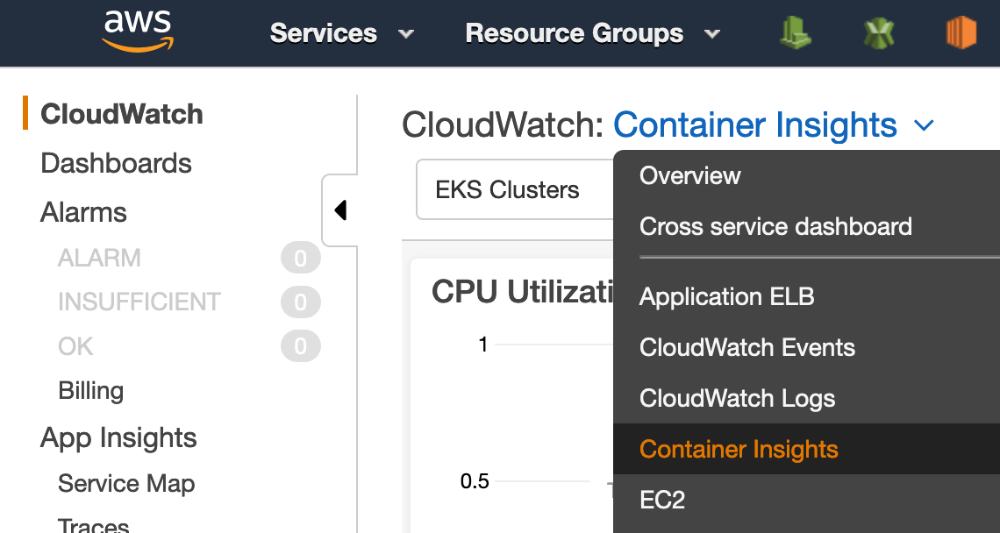

선택 ECS 클러스터를 첫 번째 드롭 다운과 두 번째 드롭 다운에서 만든 클러스터 ECS를 선택합니다. 아래와 같이 기본 대시보드에서 CPU 사용률, 메모리 사용률, 네트워크 및 기타 정보와 같은 다양한 클러스터 수준 메트릭을 보여주는 여러 내장 차트를 볼 수 있습니다.

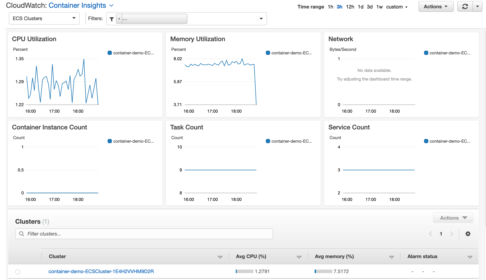

클러스터 이름을 선택하고 아래와 같이 작업 드롭다운을 클릭하여 성능 로그를 볼 수도 있습니다.


또한 아래와 같이 첫 번째 드롭다운에서 ECS 서비스를 선택하기만 하면 클러스터를 드릴다운하고 서비스 수준에서 메트릭을 볼 수 있습니다. 대시보드는 작업 정보, 배포 정보와 같은 ECS 서비스와 관련된 차트를 표시하도록 조정됩니다.

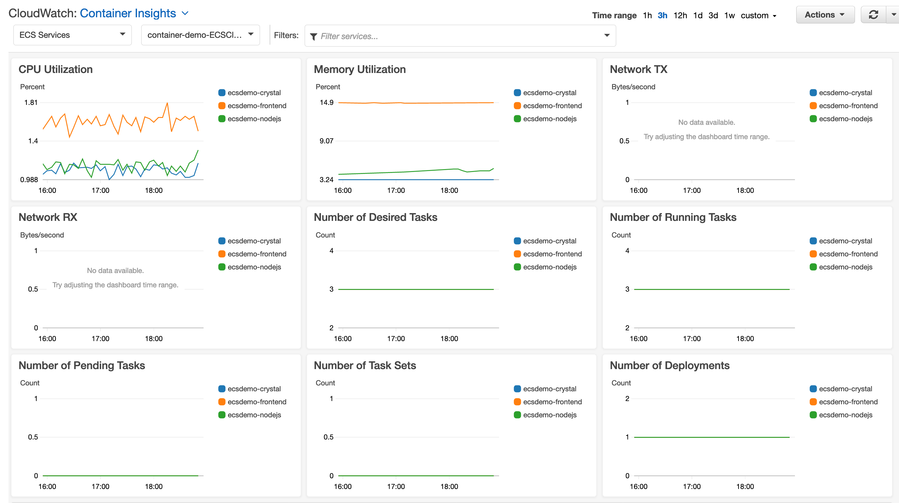

아래로 스크롤하여 나열된 서비스의 일부인 모든 작업을 확인합니다. 목록에서 작업을 선택 하고 작업 드롭다운을 클릭하여 작업별 애플리케이션 로그, X-Ray 추적 및 성능 로그를 볼 수 있습니다.

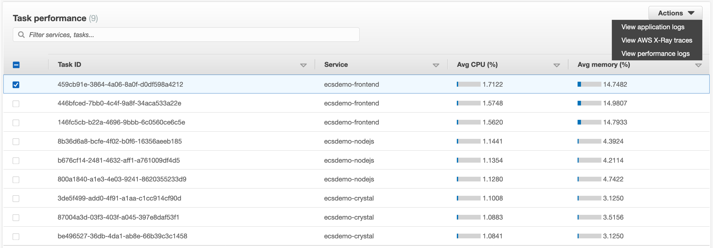

선택 ECS 작업을 첫 번째 드롭 다운과 두 번째 드롭 다운에서 만든 클러스터 ECS를 선택합니다. 아래와 같이 기본 대시보드에서 CPU 사용률, 메모리 사용률, 네트워크, 실행 중인 작업 수, 보류 중인 작업 수 및 기타 정보와 같은 다양한 작업 수준 메트릭을 보여주는 여러 내장 차트를 볼 수 있습니다.

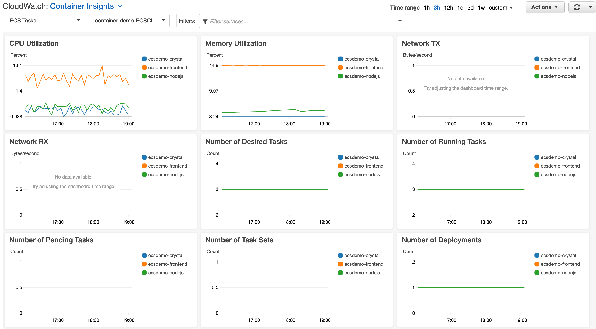

서비스에서 작업의 일부인 모든 컨테이너를 보려면 아래로 스크롤합니다. 목록에서 컨테이너를 선택하고 작업 드롭다운을 클릭하여 컨테이너별 애플리케이션 로그, X-Ray 추적 및 성능 로그를 볼 수 있습니다.


인스턴스 수준 통찰력도 설치했기 때문에 첫 번째 드롭다운에서 ECS 인스턴스 를 선택하여 인스턴스 수준에서 통찰력을 볼 수 있습니다.

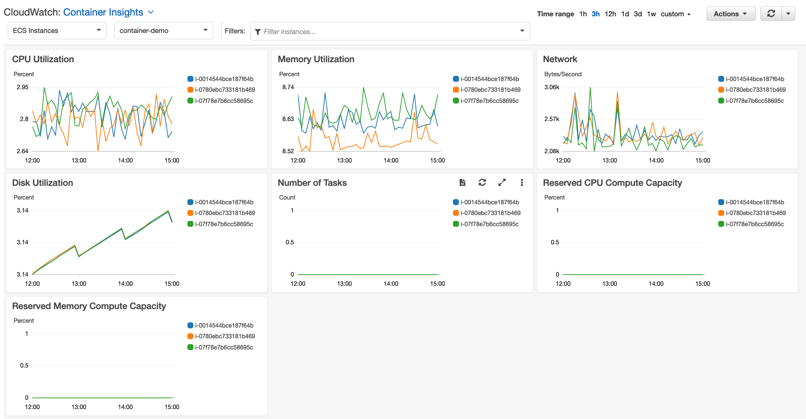

## 부하 테스트 설정

부하 테스트 준비 이제 ECS 환경에 대한 모니터링이 활성화되었습니다. Container Insights를 사용하여 메트릭이 어떻게 표시되는지 확인하기 위해 환경에 수동 로드를 유도해 보겠습니다. 부하 테스트를 수행하기 위해 Siege를 사용할 것입니다.

```
# Install Siege for load testing
sudo yum -y install siege
```

터미널 창에 아래를 입력하여 Siege가 작동하는지 확인하십시오.

```
siege --version
```


## 부하 테스트 수행

Siege를 실행하여 애플리케이션 로드 테스트 로드 테스트를 시작하기 위해 로드 밸런서 URL을 잡아봅시다.

```
alb_url=$(aws cloudformation describe-stacks --stack-name container-demo-alb --query 'Stacks[0].Outputs[?OutputKey==`ExternalUrl`].OutputValue' --output text 2> /dev/null || aws cloudformation describe-stacks --stack-name ecsworkshop-frontend | jq -r '.Stacks[].Outputs[] | select(.OutputKey | contains("FrontendFargateLBServiceServiceURL")) | .OutputValue')
```

참고 : 오류가 표시되는 경우

Siege 디렉터리의 터미널 창에서 다음 명령을 실행합니다.

```
siege -c 200 -i $alb_url
```

이 명령은 다양한 URL에서 ECS 애플리케이션에 대한 200개의 동시 연결을 실행하도록 Siege에 지시합니다. 아래와 같은 출력이 표시되어야 합니다. 처음에는 사이트 루트에 대한 연결이 표시되고 사이트의 다양한 URL로 이동하는 것을 볼 수 있어야 합니다.

이 테스트를 15-20초 동안 실행한 다음 터미널 창에서 ctrl+c로 종료할 수 있습니다. 더 오래 실행할 수 있지만 약 30초 이내에 클러스터의 열린 연결이 최대화되고 자체적으로 종료됩니다.

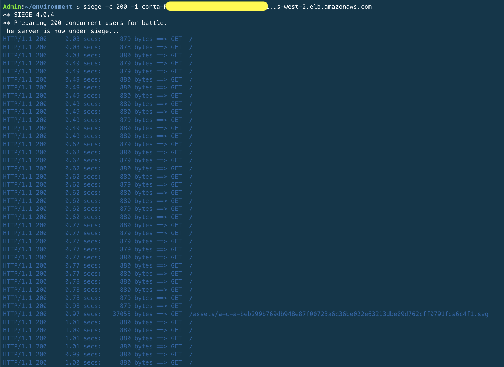

## 부하 테스트 측정항목

Container Insights 홈 페이지로 이동하여 아래와 같이 시간 범위를 15분 으로 선택합니다.


아래 스크린샷에서 메트릭이 그래프 위젯에 표시되기 시작하는 것을 볼 수 있습니다. 특히, Siege가 애플리케이션의 로드를 증가시키면 CPU 사용률이 증가하는 것을 확인하십시오.

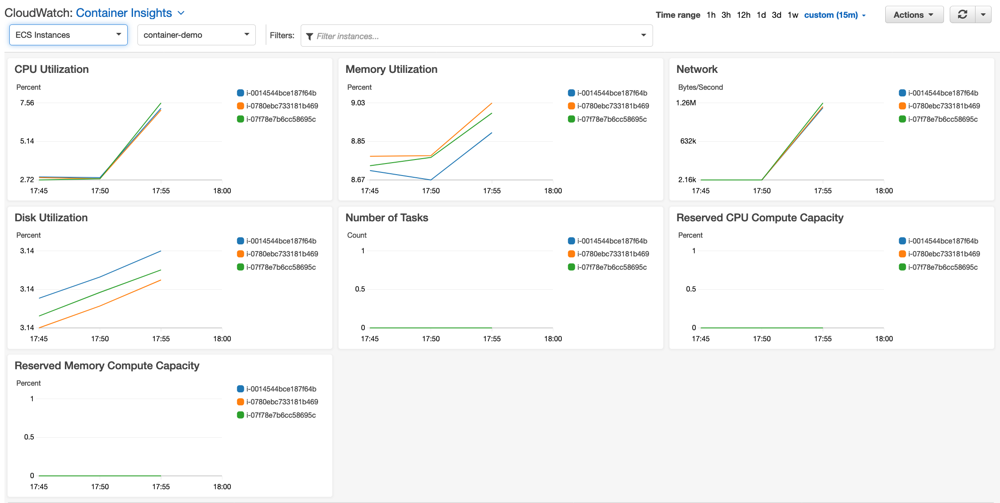

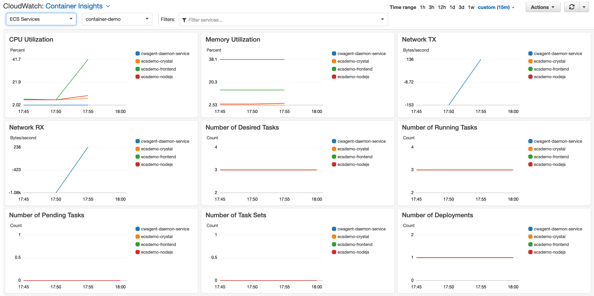

## CLOUDWATCH 지표에 대한 경보 설정

CloudWatch 경보 Container Insights를 통해 캡처된 메트릭은 환경 동작의 이상에 대한 알림을 받도록 경보를 설정하는 데 사용할 수 있습니다.

CloudWatch Container Insights에서는 드릴다운하여 애플리케이션의 CPU 사용률을 위한 CloudWatch를 사용하여 경보를 생성하겠습니다. ECS Services를 선택 하고 CPU Utilization 상자의 오른쪽 상단에 있는 세 개의 수직 점을 클릭합니다. 그리고 메트릭 에서 보기를 선택 합니다.

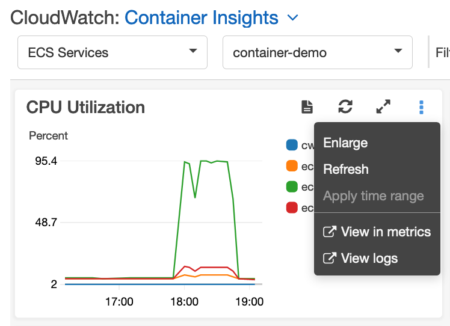

그러면 아래와 같은 화면으로 이동합니다. ecsdemo-frontend 서비스의 CPU 사용률 스파이크가 꽤 있음을 알 수 있습니다 . ecsdemo-frontend 라인 항목에 해당하는 🔔 아이콘을 클릭하여 이 메트릭에 대한 경보를 설정해 보겠습니다 .

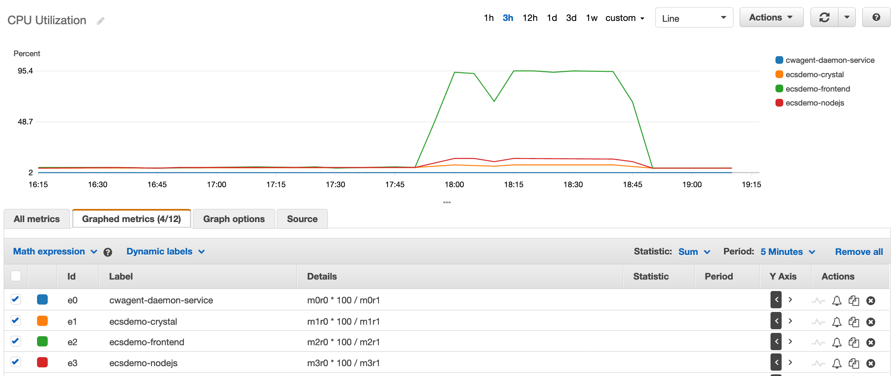

메트릭 조건 지정 화면, 기본값으로 휴가 모두를 입력합니다 (50) 에서 임계 값을 정의 화면. 이렇게 하면 경보에 대한 CPU 사용률 임계값을 50%로 설정합니다. 다음 선택

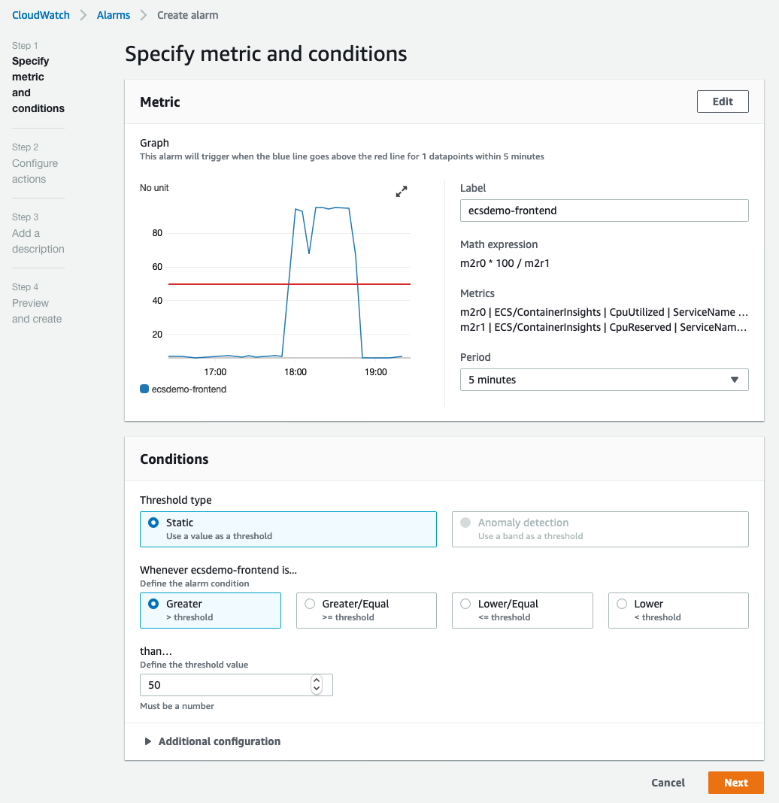

구성 작업 화면, 선택 새 항목 만들기 옵션 및 경보 알림을 보낼 할 수있는 이메일 ID를 입력합니다. 다음 선택

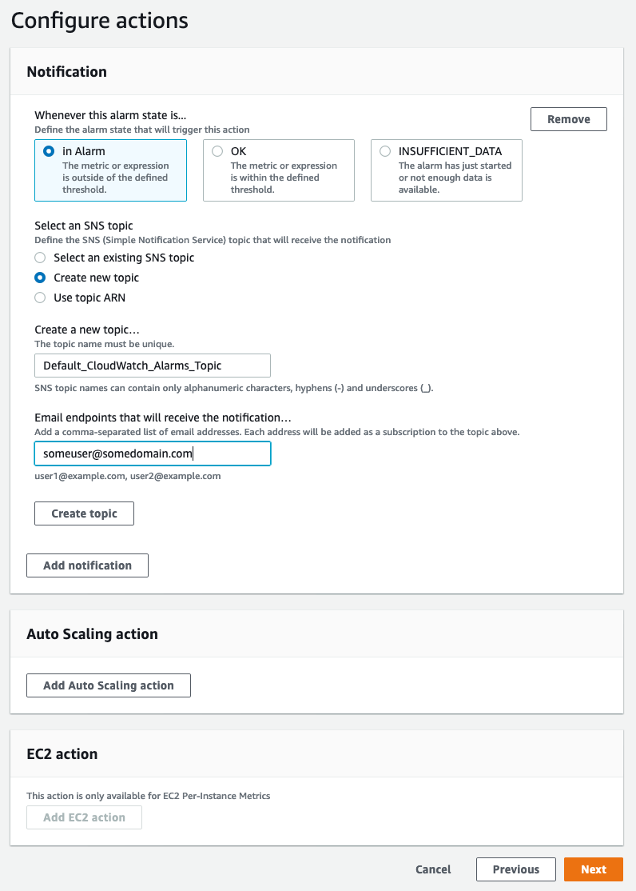

설명의 추가 화면, 알람의 이름을 입력하고 선택 다음을

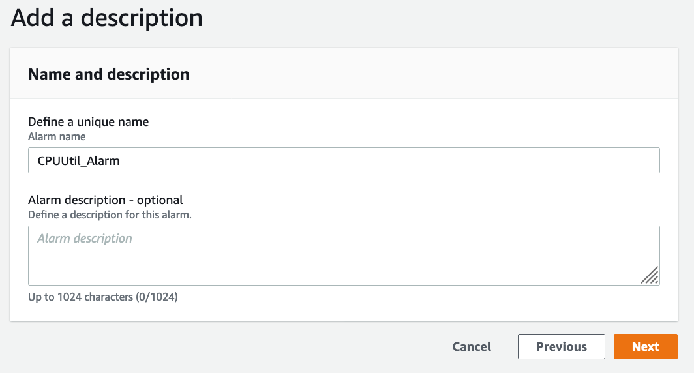

검토 화면에서 알람 생성을 선택하여 알람 을 생성합니다. 완료되면 아래와 같은 화면을 볼 수 있어야 합니다.


이제 입력한 이메일 받은 편지함으로 이동하여 확인 이메일을 찾아 CloudWatch에서 경보 알림을 수신할 것임을 확인합니다.


구독 확인 을 클릭하면 아래와 같은 확인 화면이 표시됩니다.

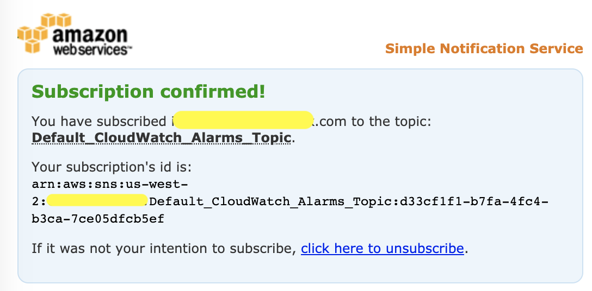

## CLOUDWATCH 경보 트리거

CloudWatch 경보를 트리거할 부하 생성 우리는 다시 한번 Siege를 사용하여 환경에 부하를 생성하여 경보가 트리거될 수 있도록 할 것입니다.

Cloud9 Workspace에서 다음 명령을 실행하고 CPU 사용률이 올라가는지 확인합니다.

```
alb_url=$(aws cloudformation describe-stacks --stack-name container-demo-alb --query 'Stacks[0].Outputs[?OutputKey==`ExternalUrl`].OutputValue' --output text 2> /dev/null || aws cloudformation describe-stacks --stack-name ecsworkshop-frontend | jq -r '.Stacks[].Outputs[] | select(.OutputKey | contains("FrontendFargateLBServiceServiceURL")) | .OutputValue')

siege -c 200 -i $alb_url
```

약 5분 정도 후에 아래와 같이 CPU 사용률이 50% 표시를 넘는 것을 볼 수 있습니다.

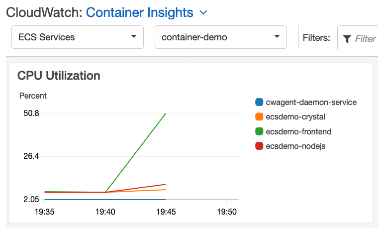

그러면 이전에 구성한 알람이 트리거됩니다. 알람의 상태는 아래와 같이 In 알람 입니다.


또한 아래와 같은 이메일 알림을 받게 됩니다.

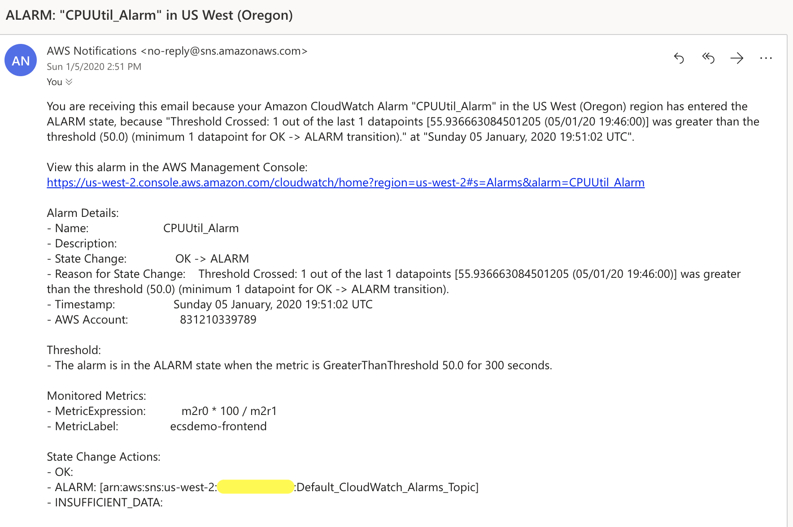

## CLOUDWATCH LOGS INSIGHTS

로그 인사이트란 무엇입니까? CloudWatch Logs InsightsCloudWatch를 위한 완전히 통합된 대화형 종량제 로그 분석 서비스입니다. CloudWatch Logs Insights를 사용하면 즉시 로그를 탐색, 분석 및 시각화할 수 있으므로 운영 문제를 쉽게 해결할 수 있습니다.

ECS에서 로그 쿼리 로 이동 CloudWatch Logs Insights선택 / AWS / ECS / containerinsights / 클러스터 이름 / 성능 로그 그룹은 다음과 같이


다음 쿼리를 복사하여 텍스트 상자에 붙여넣고 쿼리 실행을 클릭합니다.

```
stats count_distinct(TaskId) as Number_of_Tasks by ServiceName
```

이 쿼리는 아래와 같이 서비스에서 실행 중인 작업 수를 보여주는 테이블을 반환합니다.


다음 쿼리는 filter 명령을 사용하여 5분마다 작업에서 사용한 평균 메모리 및 CPU를 보여주는 테이블을 반환합니다.

```
stats avg(MemoryUtilized) as Avg_Memory, avg(CpuUtilized) as Avg_CPU by bin(5m)
| filter Type="Task"
```

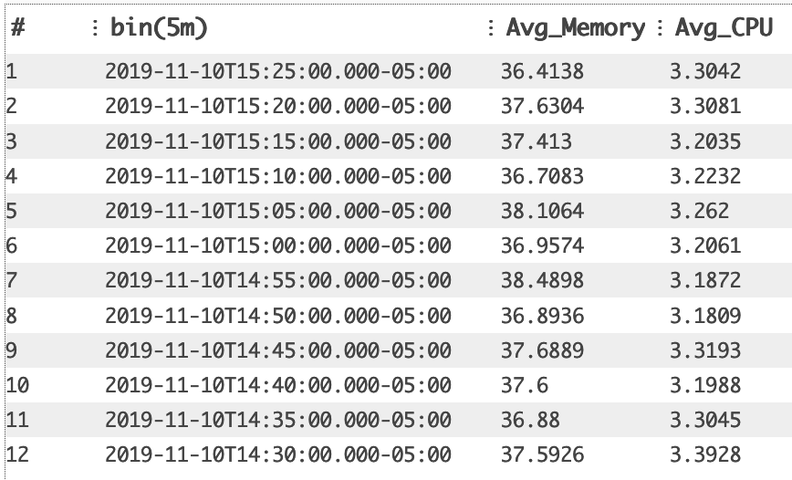

시각화 탭을 클릭하기만 하면 그래프에서 출력을 시각화할 수도 있습니다 . 다음 스크린샷은 동일한 보고서의 막대 차트를 보여줍니다.

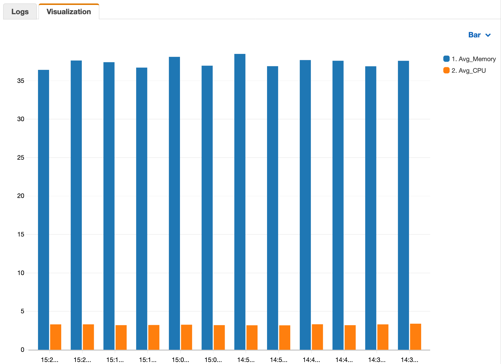

## 리소스 정리

보시다시피 CloudWatch Container Insights를 작동시키고 CPU 및 기타 지표에 대한 경보를 설정하는 것은 매우 쉽습니다. CloudWatch Container Insights를 사용하면 자체 모니터링 인프라를 관리 및 업데이트할 필요가 없으며 플랫폼을 관리할 필요가 없는 기본 AWS 솔루션을 사용할 수 있습니다.

컨테이너 인사이트 비활성화 ECS 클러스터에 대한 컨테이너 통찰력을 비활성화하려면 다음 명령을 실행합니다.

```
aws ecs update-cluster-settings --cluster ${clustername} --settings name=containerInsights,value=disabled --region ${AWS_REGION}
```

출력은 아래와 유사해야 합니다.

```
{
    "cluster": {
        "status": "ACTIVE", 
        "statistics": [], 
        "tags": [], 
        "clusterName": "container-demo-ECSCluster-1E4H2VVHM9D2R", 
        "settings": [
            {
                "name": "containerInsights", 
                "value": "disabled"
            }
        ], 
        "registeredContainerInstancesCount": 0, 
        "pendingTasksCount": 0, 
        "runningTasksCount": 0, 
        "activeServicesCount": 0, 
        "clusterArn": "arn:aws:ecs:us-west-2:123456789:cluster/container-demo-ECSCluster-1E4H2VVHM9D2R"
    }
}
```

\[CloudFormation]으로 이동(https://console.aws.amazon.com/cloudformation/home) 인스턴스 수준 통찰력을 활성화하기 위해 생성된 스택을 삭제합니다.

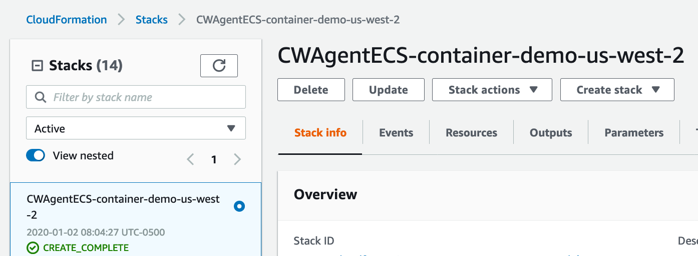

프런트엔드 서비스 스택과 플랫폼 스택을 삭제합니다.

```
cd ~/environment/ecsdemo-frontend/cdk
cdk destroy -f
cd ~/environment/ecsdemo-nodejs/cdk
cdk destroy -f
cd ~/environment/ecsdemo-crystal/cdk
cdk destroy -f
cd ~/environment/container-demo/cdk
cdk destroy -f

python -c "import boto3
c = boto3.client('logs')
services = ['ecsworkshop-frontend', 'ecsworkshop-nodejs', 'ecsworkshop-crystal']
for service in services:
    frontend_logs = c.describe_log_groups(logGroupNamePrefix=service)
    print([c.delete_log_group(logGroupName=x['logGroupName']) for x in frontend_logs['logGroups']])"
```
